<div align="center">

# ⚡ PhishLens

### High-Precision AI Scam & Phishing Detection System with OCR & Real-Time ML Inference

<br/>

<div align="center">
    <a href="#-quick-start">Quick Start</a> •
    <a href="#-key-features">Features</a> •
    <a href="#-live-benchmarks--evaluation">Benchmarks</a> •
    <a href="#-rest-api-reference">API Reference</a> •
    <a href="#-neo-brutalist-web-ui">Web UI</a> •
    <a href="#-docker-deployment">Docker</a>
</div>

<br/>

**The precision-first defense against SMS fraud and screenshot smishing.**<br>
PhishLens is a production-grade machine learning and OCR platform engineered to detect phishing attacks in SMS texts and mobile screenshots with calibrated risk scoring, explainable signals, and zero data retention.

<br/>

[](https://www.python.org/)
[](https://fastapi.tiangolo.com/)
[](https://scikit-learn.org/)
[](https://github.com/RapidAI/RapidOCR)
[](reports/metrics.json)
[](reports/metrics.json)
[](LICENSE)

</div>

<br/>

---

## 🧭 Architecture

```mermaid
flowchart LR
    subgraph Inputs [Input Modalities]
        A["💬 SMS / Raw Text"]
        B["📸 Screenshot Image"]
    end

    subgraph OCR_Engine [OCR Processing]
        B --> B1["OpenCV CLAHE Enhancement"]
        B1 --> B2["RapidOCR ONNX Engine"]
        B2 --> B3["Extracted Text & Confidence"]
    end

    subgraph ML_Pipeline [ML Inference Pipeline]
        A --> C["Entity Normalizer\n(&lt;URL&gt;, &lt;PHONE&gt;, &lt;AMOUNT&gt;)"]
        B3 --> C
        C --> D["Word + Char TF-IDF"]
        D --> E["Calibrated Logistic Regression"]
        E --> F["Scam Probability P(scam)"]
        F --> G{"Threshold\nP >= 0.42"}
    end

    subgraph Outputs [Verdicts & Signals]
        G -->|Yes| H["🚨 SCAM (High Risk)"]
        G -->|No| I["✅ NOT_SCAM (Low Risk)"]
        H --> J["Explainable Risk Signals"]
        I --> J
        J --> K["FastAPI / Neo-Brutalist UI"]
    end
```



---

## ✨ Key Features

<table>
<tr>
<td width="50%" valign="top">

### 💬 Dual Input Modalities
Accepts raw text messages as well as smartphone screenshots (PNG, JPG, WEBP), parsing message text automatically using embedded OCR.

</td>
<td width="50%" valign="top">

### 🎯 Precision-Targeted Objective
Unlike standard classifiers optimized purely for accuracy, PhishLens tunes decision cutoffs strictly on validation data to achieve **SCAM Precision ≥ 90%** (operating point: `0.4200`).

</td>
</tr>
<tr>
<td width="50%" valign="top">

### 🔍 Explainable Risk Signals
Extracts salient positive TF-IDF model terms, suspicious domains/URLs, phone numbers, and urgent trigger patterns (e.g. KYC, blocked account, OTP prompts).

</td>
<td width="50%" valign="top">

### ⚡ Rapid Local OCR
Powered by `rapidocr_onnxruntime` and OpenCV adaptive contrast equalization. Runs on CPU via ONNX without external binary dependencies.

</td>
</tr>
<tr>
<td width="50%" valign="top">

### 🎨 Neo-Brutalist Web UI
Features a high-contrast Neo-Brutalist design system with drag-and-drop screenshot uploads, 1-click test presets, live risk gauge, and raw JSON inspectors.

</td>
<td width="50%" valign="top">

### 🛡️ Enterprise Security & Privacy
Zero message logging and immediate in-memory screenshot disposal. Fully typed with Pydantic schemas, CORS configuration, and payload validation.

</td>
</tr>
</table>

---

## ⚡ Quick Start

### 1. Clone & Install

```bash
git clone https://github.com/pprbkt/PhishLens.git
cd PhishLens

pip install -r requirements.txt
```

### 2. Download Data & Train Pipeline

```bash
# 1. Fetch benchmark dataset + synthesize modern smishing examples (5,609 records)
python scripts/download_data.py

# 2. Run leakage-free training, validation benchmarking, and threshold tuning
python training/train.py
```

### 3. Launch Web Server & UI

```bash
uvicorn app.main:app --host 0.0.0.0 --port 8000 --reload
```

- 🌐 **Neo-Brutalist Web Interface**: [http://localhost:8000](http://localhost:8000)
- 📖 **Interactive Swagger UI**: [http://localhost:8000/docs](http://localhost:8000/docs)

---

## 📊 Live Benchmarks & Evaluation

All metrics are evaluated strictly on the **held-out 15% unseen test split (842 samples)**:

<div align="center">

| Metric | Score | Target | Status |
| :--- | :---: | :---: | :---: |
| **Overall Accuracy** | **99.05%** | `> 95.0%` | ✅ **Exceeded** |
| **SCAM Precision** | **95.73%** | `≥ 90.0%` | ✅ **Exceeded** |
| **SCAM Recall** | **97.39%** | `> 90.0%` | ✅ **Exceeded** |
| **SCAM F1-Score** | **0.9655** | `> 0.90` | ✅ **Exceeded** |
| **ROC-AUC** | **0.9987** | `> 0.98` | ✅ **Exceeded** |
| **PR-AUC** | **0.9934** | `> 0.95` | ✅ **Exceeded** |

</div>

### Model Comparison on Validation Split

| Model Architecture | Accuracy | SCAM Precision | SCAM Recall | SCAM F1 |
| :--- | :---: | :---: | :---: | :---: |
| **TF-IDF + Logistic Regression (Selected)** | **98.81%** | **95.65%** | **95.65%** | **0.9565** |
| TF-IDF + Linear SVM | 98.81% | 95.65% | 95.65% | 0.9565 |
| TF-IDF + Multinomial Naive Bayes | 98.45% | 94.74% | 93.91% | 0.9432 |

### Test Confusion Matrix Breakdown (842 Samples)
- **True Negatives (`NOT_SCAM`)**: 722
- **False Positives**: 5 *(0.59% false alarm rate)*
- **False Negatives**: 3
- **True Positives (`SCAM`)**: 112

Visual artifact charts are automatically produced in [`reports/confusion_matrix.png`](file:///c:/Users/Hades/Documents/PhishLens/reports/confusion_matrix.png) and [`reports/precision_recall_curve.png`](file:///c:/Users/Hades/Documents/PhishLens/reports/precision_recall_curve.png).

---

## 🔌 REST API Reference

<details open>
<summary><strong>1. Single Text Phishing Detection — <code>POST /predict/text</code></strong></summary>

#### Request
```bash
curl -X POST "http://localhost:8000/predict/text" \
  -H "Content-Type: application/json" \
  -d '{
    "text": "URGENT: Your SBI account has been blocked due to KYC. Update PAN card immediately at http://sbi-kyc-update.top"
  }'
```

#### Response
```json
{
  "prediction": "SCAM",
  "scam_probability": 0.9505,
  "threshold": 0.42,
  "risk_level": "HIGH_RISK",
  "cleaned_text": "urgent : your sbi account has been blocked due to kyc . update pan card immediately at <url>",
  "signals": [
    "Suspicious link/URL: http://sbi-kyc-update.top",
    "High-risk indicator: 'urgent'",
    "High-risk indicator: 'immediately'",
    "High-risk indicator: 'kyc'",
    "Model term weight: 'at url'"
  ],
  "model_version": "phishlens-v1"
}
```
</details>

<details>
<summary><strong>2. Screenshot OCR Scam Detection — <code>POST /predict/image</code></strong></summary>

#### Request
```bash
curl -X POST "http://localhost:8000/predict/image" \
  -F "file=@screenshot.png"
```

#### Response
```json
{
  "prediction": "SCAM",
  "scam_probability": 0.9282,
  "threshold": 0.42,
  "risk_level": "HIGH_RISK",
  "extracted_text": "USPS: We tried to deliver your parcel today. Confirm address at http://usps-redelivery.site",
  "ocr_confidence": 0.9420,
  "signals": [
    "Suspicious link/URL: http://usps-redelivery.site",
    "High-risk indicator: 'parcel'"
  ],
  "model_version": "phishlens-v1"
}
```
</details>

<details>
<summary><strong>3. Batch Text Detection — <code>POST /predict/batch</code></strong></summary>

#### Request
```bash
curl -X POST "http://localhost:8000/predict/batch" \
  -H "Content-Type: application/json" \
  -d '{
    "texts": [
      "Win ₹1,00,000 cash prize now! Call 9876543210",
      "Hey, are we still meeting for coffee at Starbucks at 5 PM?"
    ]
  }'
```

#### Response
```json
{
  "total_processed": 2,
  "scam_count": 1,
  "not_scam_count": 1,
  "results": [
    {
      "text": "Win ₹1,00,000 cash prize now! Call 9876543210",
      "prediction": "SCAM",
      "scam_probability": 0.9999,
      "risk_level": "HIGH_RISK",
      "threshold": 0.42,
      "signals": [
        "Financial amount requested/mentioned: ₹1,00,000",
        "Phone contact prompt: 9876543210"
      ],
      "model_version": "phishlens-v1"
    },
    {
      "text": "Hey, are we still meeting for coffee at Starbucks at 5 PM?",
      "prediction": "NOT_SCAM",
      "scam_probability": 0.0220,
      "risk_level": "LOW_RISK",
      "threshold": 0.42,
      "signals": [],
      "model_version": "phishlens-v1"
    }
  ]
}
```
</details>

<details>
<summary><strong>4. Health & Metrics Inspection — <code>GET /health</code> & <code>GET /metrics</code></strong></summary>

#### `GET /health`
```json
{
  "status": "ok",
  "model_loaded": true,
  "model_version": "phishlens-v1",
  "operating_threshold": 0.42
}
```
</details>

---

## 🎨 Neo-Brutalist Web UI

PhishLens includes a responsive, high-energy **Neo-Brutalist** dashboard served directly at `/`:

- **Design Tokens**: Solid black borders (`3px solid #000`), hard shadows (`5px 5px 0 #000`), lemon yellow (`#FFE600`), neon orange (`#FF5C00`), and electric cyan accents.
- **Interactive Preset Chips**: Instant 1-click loading for Bank KYC Scams, FedEx Smishing, Crypto Giveaways, Legitimate Bank OTPs, and Uber alerts.
- **Dynamic Risk Gauge**: Visual probability bar with real-time operating threshold indicator and uncertainty banding (`HIGH_RISK`, `UNCERTAIN`, `LOW_RISK`).
- **Screenshot Drag & Drop**: Native drag-and-drop file upload with live preview and OCR text drawer.

---

## 📂 Project Structure

```text
PhishLens/
├── app/
│   ├── api/
│   │   ├── routes.py               # REST API endpoints
│   │   └── schemas.py              # Pydantic request & response models
│   ├── ml/
│   │   ├── preprocess.py           # Text cleaner & entity normalizer
│   │   ├── classifier.py           # ModelManager runtime loader
│   │   ├── threshold.py            # Precision threshold & risk banding
│   │   ├── explain.py              # Term contribution & risk signal extractor
│   │   └── inference.py            # Inference engine
│   ├── ocr/
│   │   ├── preprocess_image.py     # OpenCV CLAHE enhancement & deskewing
│   │   └── extractor.py            # RapidOCR ONNX inference wrapper
│   ├── static/
│   │   ├── index.html              # Neo-Brutalist web interface
│   │   ├── style.css               # Neo-Brutalist styling & animations
│   │   └── app.js                  # UI controller & async fetch logic
│   ├── config.py                   # Pydantic Settings configuration
│   └── main.py                     # FastAPI entry point & CORS
├── data/
│   ├── raw/                        # Raw SMS and modern smishing dataset
│   ├── processed/                  # Stratified train / val / test splits
│   └── README.md                   # Dataset provenance & schema
├── training/
│   ├── train.py                    # End-to-end training orchestrator
│   ├── compare_models.py           # Model benchmarking module
│   ├── tune_threshold.py           # Precision-oriented threshold tuner
│   └── evaluate.py                 # Evaluation & visual report generator
├── models/
│   ├── classifier.joblib           # Serialized Logistic Regression model
│   ├── vectorizer.joblib           # Serialized Word + Char TF-IDF vectorizer
│   └── metadata.json               # Model metrics and configuration
├── reports/
│   ├── metrics.json                # Test evaluation metrics
│   ├── classification_report.txt   # Scikit-learn classification report
│   ├── confusion_matrix.png        # Confusion matrix visual chart
│   ├── precision_recall_curve.png  # PR curve visual chart
│   └── threshold_analysis.csv      # Validation threshold sweep data
├── scripts/
│   └── download_data.py            # Dataset downloader & synthesizer
├── tests/
│   ├── test_preprocessing.py       # Preprocessing unit tests
│   ├── test_classifier.py          # Classifier & threshold unit tests
│   ├── test_ocr.py                 # OCR & OpenCV image tests
│   └── test_api.py                 # FastAPI integration tests
├── notebooks/
│   └── exploration.ipynb           # Exploratory data analysis notebook
├── requirements.txt
├── .env.example
├── Dockerfile
├── docker-compose.yml
└── README.md
```

---

## 🐳 Docker Deployment

Run the complete PhishLens application container with Docker Compose:

```bash
docker compose up --build -d
```

Check container status:
```bash
docker compose ps
```

---

## 🧪 Running Tests

Execute the full automated test suite with pytest:

```bash
pytest -v
```

```text
tests/test_api.py::test_health_endpoint PASSED                           [  4%]
tests/test_api.py::test_metrics_endpoint PASSED                          [  8%]
tests/test_api.py::test_predict_text_scam PASSED                         [ 12%]
tests/test_api.py::test_predict_text_benign PASSED                       [ 16%]
tests/test_api.py::test_predict_image_endpoint PASSED                    [ 24%]
tests/test_classifier.py::test_model_loading PASSED                      [ 36%]
tests/test_classifier.py::test_threshold_logic PASSED                    [ 40%]
tests/test_ocr.py::test_ocr_extraction_valid_image PASSED                [ 72%]
tests/test_preprocessing.py::test_url_detection_and_replacement PASSED   [ 88%]
======================= 25 passed in 3.56s =======================
```

---

## ⚠️ Limitations & Responsible Use

- **Probabilistic Risk Tool**: PhishLens provides calibrated risk assessments to assist users and analysts; it is not a complete replacement for endpoint antivirus or hardware security keys.
- **Image Quality**: Heavily distorted, low-contrast, or handwritten screenshot text can reduce OCR accuracy.
- **Zero-Day Smishing**: Emerging evasion patterns may require periodic retraining on updated threat corpora.

---

## 📄 License

This project is licensed under the [MIT License](LICENSE).
