<div align="center">

# PhishLens

### SMS and Screenshot Scam Detection Pipeline with OCR and Machine Learning

<br/>

<div align="center">
    <a href="#quick-start">Quick Start</a> •
    <a href="#key-features">Features</a> •
    <a href="#benchmarks-and-evaluation">Benchmarks</a> •
    <a href="#api-reference">API Reference</a> •
    <a href="#web-interface">Web Interface</a> •
    <a href="#docker-deployment">Docker</a>
</div>

<br/>

A precision-oriented machine learning system designed to detect phishing and scam attempts across SMS text messages and smartphone screenshots. PhishLens combines optical character recognition (OCR), text entity normalization, and a calibrated TF-IDF classifier to output confidence-scored scam probabilities with explainable risk indicators.

<br/>

[](https://www.python.org/)
[](https://fastapi.tiangolo.com/)
[](https://scikit-learn.org/)
[](https://github.com/RapidAI/RapidOCR)
[](reports/metrics.json)
[](reports/metrics.json)
[](LICENSE)

</div>

<br/>

---

## Architecture

```mermaid
flowchart LR
    subgraph Inputs [Input Modalities]
        A["SMS / Text String"]
        B["Screenshot Image"]
    end

    subgraph OCR_Engine [OCR Processing]
        B --> B1["OpenCV Preprocessing\n(Grayscale, CLAHE Contrast)"]
        B1 --> B2["RapidOCR ONNX Engine"]
        B2 --> B3["Extracted Text + Confidence"]
    end

    subgraph ML_Pipeline [ML Inference Pipeline]
        A --> C["Text Normalization\n(&lt;URL&gt;, &lt;PHONE&gt;, &lt;AMOUNT&gt;, &lt;EMAIL&gt;)"]
        B3 --> C
        C --> D["Word & Char n-gram TF-IDF"]
        D --> E["Calibrated Logistic Regression"]
        E --> F["Scam Probability P(scam)"]
        F --> G{"Decision Threshold\nP >= 0.42"}
    end

    subgraph Outputs [Verdicts & Signals]
        G -->|Yes| H["SCAM (High Risk)"]
        G -->|No| I["NOT_SCAM (Low Risk)"]
        H --> J["Explainable Risk Signals"]
        I --> J
        J --> K["FastAPI / Web Dashboard"]
    end
```



---

## Key Features

<table>
<tr>
<td width="50%" valign="top">

### Dual Modality Ingestion
Accepts raw text payloads directly or extracts text from user-uploaded screenshots (PNG, JPG, WEBP) using an integrated OCR pipeline.

</td>
<td width="50%" valign="top">

### Precision-Oriented Threshold Tuning
Optimizes decision cutoffs specifically on validation data to maintain high SCAM precision (>= 90%) while retaining high recall, preventing false positives on transactional SMS messages.

</td>
</tr>
<tr>
<td width="50%" valign="top">

### Explainable Risk Signals
Extracts salient positive TF-IDF feature weights, suspicious domain structures, payment indicators, and domain-specific urgency patterns.

</td>
<td width="50%" valign="top">

### Embedded ONNX OCR Engine
Utilizes `rapidocr_onnxruntime` with OpenCV contrast enhancement. Executes locally on CPU without external binary dependencies or system daemon requirements.

</td>
</tr>
<tr>
<td width="50%" valign="top">

### Neo-Brutalist Dashboard
Includes an interactive web interface with drag-and-drop screenshot uploads, test presets, real-time probability meters, and raw JSON inspection.

</td>
<td width="50%" valign="top">

### Stateless Execution & Privacy
Operates statelessly without storing uploaded screenshots or persisting sensitive SMS payloads. Complete request validation via Pydantic schemas.

</td>
</tr>
</table>

---

## Quick Start

### Option A: Windows 1-Click Launch (Recommended)

Double-click `run.bat` in the project root, or execute from PowerShell / Command Prompt:

```cmd
run.bat
```

This script automatically verifies dependencies, runs training if model artifacts are missing, starts the FastAPI server on port 8080, and opens your default browser.

---

### Option B: Manual Setup

#### 1. Clone & Install Dependencies

```bash
git clone https://github.com/pprbkt/PhishLens.git
cd PhishLens

pip install -r requirements.txt
```

#### 2. Download Dataset & Train Model

```bash
# Download benchmark dataset and modern smishing samples (5,609 records)
python scripts/download_data.py

# Run training, threshold optimization, and report generation
python training/train.py
```

#### 3. Start the Server

```bash
uvicorn app.main:app --host 0.0.0.0 --port 8080 --reload
```

- Web Interface: [http://localhost:8080](http://localhost:8080)
- Swagger API Docs: [http://localhost:8080/docs](http://localhost:8080/docs)

---

## Benchmarks and Evaluation

Model evaluation was conducted on a held-out, stratified test set representing 15% of the total dataset (842 samples). Threshold tuning was performed strictly on the validation set to prevent data leakage.

<div align="center">

| Metric | Score | Validation Target | Status |
| :--- | :---: | :---: | :---: |
| **Accuracy** | **99.05%** | > 95.0% | Met |
| **SCAM Precision** | **95.73%** | >= 90.0% | Met |
| **SCAM Recall** | **97.39%** | > 90.0% | Met |
| **SCAM F1-Score** | **0.9655** | > 0.90 | Met |
| **ROC-AUC** | **0.9987** | > 0.98 | Met |
| **PR-AUC** | **0.9934** | > 0.95 | Met |

</div>

### Model Comparison on Validation Split

| Model Architecture | Accuracy | SCAM Precision | SCAM Recall | SCAM F1 |
| :--- | :---: | :---: | :---: | :---: |
| **TF-IDF + Logistic Regression (Selected)** | **98.81%** | **95.65%** | **95.65%** | **0.9565** |
| TF-IDF + Linear SVM | 98.81% | 95.65% | 95.65% | 0.9565 |
| TF-IDF + Multinomial Naive Bayes | 98.45% | 94.74% | 93.91% | 0.9432 |

### Test Split Confusion Matrix (842 Samples)

- **True Negatives (`NOT_SCAM`)**: 722
- **False Positives**: 5 (0.59% false positive rate)
- **False Negatives**: 3
- **True Positives (`SCAM`)**: 112

Visual reports and charts are saved to `reports/confusion_matrix.png` and `reports/precision_recall_curve.png`.

---

## API Reference

<details open>
<summary><strong>1. Text Prediction — <code>POST /predict/text</code></strong></summary>

#### Request
```bash
curl -X POST "http://localhost:8080/predict/text" \
  -H "Content-Type: application/json" \
  -d '{
    "text": "URGENT: Your SBI account has been blocked due to KYC. Update PAN card at http://sbi-kyc-update.top"
  }'
```

#### Response
```json
{
  "prediction": "SCAM",
  "scam_probability": 0.9505,
  "threshold": 0.42,
  "risk_level": "HIGH_RISK",
  "cleaned_text": "urgent : your sbi account has been blocked due to kyc . update pan card at <url>",
  "signals": [
    "Suspicious link/URL: http://sbi-kyc-update.top",
    "High-risk indicator: 'urgent'",
    "High-risk indicator: 'kyc'",
    "Model term weight: 'at url'"
  ],
  "model_version": "phishlens-v1"
}
```
</details>

<details>
<summary><strong>2. Screenshot OCR Prediction — <code>POST /predict/image</code></strong></summary>

#### Request
```bash
curl -X POST "http://localhost:8080/predict/image" \
  -F "file=@screenshot.png"
```

#### Response
```json
{
  "prediction": "SCAM",
  "scam_probability": 0.9282,
  "threshold": 0.42,
  "risk_level": "HIGH_RISK",
  "extracted_text": "USPS: We tried to deliver your parcel today. Confirm address at http://usps-redelivery.site",
  "ocr_confidence": 0.9420,
  "signals": [
    "Suspicious link/URL: http://usps-redelivery.site",
    "High-risk indicator: 'parcel'"
  ],
  "model_version": "phishlens-v1"
}
```
</details>

<details>
<summary><strong>3. Batch Text Prediction — <code>POST /predict/batch</code></strong></summary>

#### Request
```bash
curl -X POST "http://localhost:8080/predict/batch" \
  -H "Content-Type: application/json" \
  -d '{
    "texts": [
      "Win 100000 cash prize now! Call 9876543210",
      "Hey, are we still meeting for lunch at 1 PM?"
    ]
  }'
```

#### Response
```json
{
  "total_processed": 2,
  "scam_count": 1,
  "not_scam_count": 1,
  "results": [
    {
      "text": "Win 100000 cash prize now! Call 9876543210",
      "prediction": "SCAM",
      "scam_probability": 0.9999,
      "risk_level": "HIGH_RISK",
      "threshold": 0.42,
      "signals": [
        "Phone contact prompt: 9876543210"
      ],
      "model_version": "phishlens-v1"
    },
    {
      "text": "Hey, are we still meeting for lunch at 1 PM?",
      "prediction": "NOT_SCAM",
      "scam_probability": 0.0220,
      "risk_level": "LOW_RISK",
      "threshold": 0.42,
      "signals": [],
      "model_version": "phishlens-v1"
    }
  ]
}
```
</details>

<details>
<summary><strong>4. Health and Status — <code>GET /health</code> and <code>GET /metrics</code></strong></summary>

#### `GET /health`
```json
{
  "status": "ok",
  "model_loaded": true,
  "model_version": "phishlens-v1",
  "operating_threshold": 0.42
}
```
</details>

---

## Web Interface

PhishLens provides a Neo-Brutalist dashboard accessible directly from the browser:

- **Input Tabs**: Switch between direct SMS text inspection and screenshot OCR file uploads.
- **Preset Buttons**: Test standard fraud vectors (KYC suspension, parcel delivery smishing, crypto lures) and legitimate transactional alerts.
- **Interactive Threshold Slider**: Adjust decision thresholds dynamically between 0.10 and 0.95 to evaluate boundary behavior.
- **Risk Indicator Drawer**: Displays risk level bands (`HIGH_RISK`, `UNCERTAIN`, `LOW_RISK`) and active feature signals.

---

## Project Structure

```text
PhishLens/
├── app/
│   ├── api/
│   │   ├── routes.py               # REST API endpoints
│   │   └── schemas.py              # Pydantic request & response models
│   ├── ml/
│   │   ├── preprocess.py           # Text cleaning & entity normalization
│   │   ├── classifier.py           # ModelManager runtime loader
│   │   ├── threshold.py            # Decision thresholding & risk band logic
│   │   ├── explain.py              # Term contribution & signal extractor
│   │   └── inference.py            # Text and batch inference coordinator
│   ├── ocr/
│   │   ├── preprocess_image.py     # OpenCV contrast enhancement & deskewing
│   │   └── extractor.py            # RapidOCR ONNX inference wrapper
│   ├── static/
│   │   ├── index.html              # Neo-Brutalist web interface
│   │   ├── style.css               # Design system & stylesheet
│   │   └── app.js                  # Frontend client application
│   ├── config.py                   # Pydantic Settings configuration
│   └── main.py                     # FastAPI entry point & CORS
├── data/
│   ├── raw/                        # Raw SMS dataset files
│   ├── processed/                  # Stratified train / val / test splits
│   └── README.md                   # Dataset documentation
├── training/
│   ├── train.py                    # End-to-end training orchestrator
│   ├── compare_models.py           # Candidate model benchmarking
│   ├── tune_threshold.py           # Validation threshold optimizer
│   └── evaluate.py                 # Evaluation & visual report generator
├── models/
│   ├── classifier.joblib           # Trained Logistic Regression model
│   ├── vectorizer.joblib           # Fitted Word + Char TF-IDF vectorizer
│   └── metadata.json               # Trained metrics and configuration
├── reports/
│   ├── metrics.json                # Test evaluation metrics
│   ├── classification_report.txt   # Classification report
│   ├── confusion_matrix.png        # Confusion matrix chart
│   ├── precision_recall_curve.png  # Precision-Recall curve chart
│   └── threshold_analysis.csv      # Validation threshold sweep data
├── scripts/
│   └── download_data.py            # Dataset fetcher & synthesizer
├── tests/
│   ├── test_preprocessing.py       # Preprocessing unit tests
│   ├── test_classifier.py          # Classifier unit tests
│   ├── test_ocr.py                 # OCR unit tests
│   └── test_api.py                 # API integration tests
├── notebooks/
│   └── exploration.ipynb           # EDA exploration notebook
├── requirements.txt
├── .env.example
├── Dockerfile
├── docker-compose.yml
├── run.bat                         # Windows 1-click startup script
└── README.md
```

---

## Docker Deployment

Run the containerized application with Docker Compose:

```bash
docker compose up --build -d
```

Check status:
```bash
docker compose ps
```

---

## Running Tests

Execute the complete automated test suite:

```bash
pytest -v
```

```text
tests/test_api.py::test_health_endpoint PASSED                           [  4%]
tests/test_api.py::test_metrics_endpoint PASSED                          [  8%]
tests/test_api.py::test_predict_text_scam PASSED                         [ 12%]
tests/test_api.py::test_predict_text_benign PASSED                       [ 16%]
tests/test_api.py::test_predict_image_endpoint PASSED                    [ 24%]
tests/test_classifier.py::test_model_loading PASSED                      [ 36%]
tests/test_classifier.py::test_threshold_logic PASSED                    [ 40%]
tests/test_ocr.py::test_ocr_extraction_valid_image PASSED                [ 72%]
tests/test_preprocessing.py::test_url_detection_and_replacement PASSED   [ 88%]
======================= 25 passed in 3.56s =======================
```

---

## Limitations and Responsible Use

- **Statistical Assessment**: Output probabilities represent statistical pattern similarity and should be utilized as an advisory indicator rather than an absolute guarantee of fraud.
- **Image Artifacts**: Severe image degradation, motion blur, or unusual handwriting can impair OCR text extraction accuracy.
- **Threat Drift**: Scam patterns evolve over time; periodic model retraining on new phishing corpora is recommended.

---

## License

This project is licensed under the [MIT License](LICENSE).
